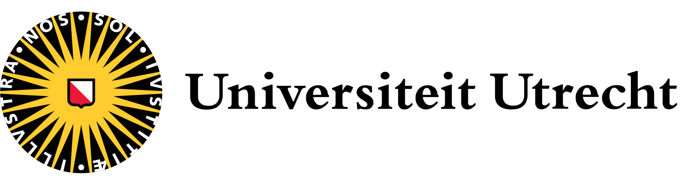

# Fusus

This is a workflow that transforms scanned pages into readable text.

The pages come from several printed Arabic books from the past few centuries.

The workflow takes care of cleaning, OCR and postprocessing.

A user can copy and paste image fragments of specks and symbols that must be removed before doing OCR.

The workflow detects column layout and line boundaries.

Individual lines will be passed to the OCR engine, which is Kraken using a model trained
on many printed Arabic books.
See [model](https://among.github.io/fusus/about/model.html).

The result is stored in tab-separated files, with the transcription computed by the OCR step,
plus position and confidence info resulting from that same step.

The workflow can generate proofing pages that support manually checking the OCR results.

# Next steps

Once we have scanned a significant amount of pages, we'll construct a dataset in
[Text-Fabric]()
format out of it, with features that preserve positions of the words on the page and their confidence.

From there we can implement steps to correct OCR mistakes and to perform intertextuality research between
the ground work (the "Fusus" by Ibn Arabi) and its commentary books.

# Authors

This is work done by Cornelis van Lit and Dirk Roorda.

There is more documentation about sources, the research project, and how to use
this software in the
[docs](https://among.github.io/fusus/).
