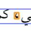
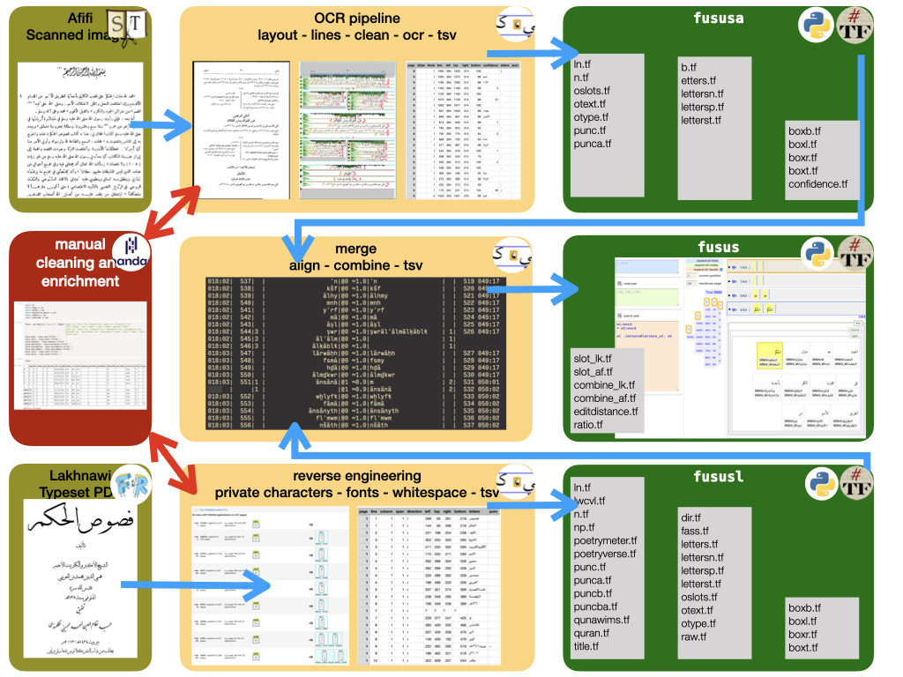

# Fusus

This is a workflow that transforms scanned pages into readable text.

The pages come from several printed Arabic books from the past few centuries.

The workflow takes care of cleaning, OCR, proofing, converting to tab separated files
and from there to
[Text-Fabric](https://github.com/annotation/text-fabric)
from where the text material can be processed further.

## Features

* cleaning is included:
  specks and symbols can be specified for cleaning by copying and pasting such fragments
  and storing them in a designated directory;
* column layout and line boundaries are detected prior to OCRing;
* individual lines will be passed to the OCR engine, which is Kraken using a model trained
  on many printed Arabic books, see [model](https://among.github.io/fusus/fusus/about/model.html);
* the results are stored in tab-separated files, retaining boundary boxes and confidences;
* proofing pages can be generated for manually checking the OCR results;
* the OCR results of each book are composed into Text-Fabric datasets.

This lays the foundations for:

* correcting OCR mistakes;
* enriching the text with morphological/linguistic annotations, named entities;
* perform intertextuality research between the ground work (the "Fusus" by Ibn Arabi)
  and its commentary books.

A lot of cleaning has been carried out on two editions of the Fusus: Lakhnawi and Afifi.
After that these editions have been aligned and brought together in a single dataset,
in which it is possible read back the individual editions.

## Authors

*   [Cornelis van Lit](https://digitalorientalist.com/about-cornelis-van-lit/)
*   [Dirk Roorda](https://www.annotation.nl)

## Project

Fusus has been funded by the IT Research Innovation Fund.

It has been developed between 2020-03-01 and 2021-03-01

Correction, enrichment and alignment of the two Fusus editions was done
from the end of the project till the end of 2021.

# Docs

There is more documentation about sources, the research project, and how to use
this software in the
[docs](https://among.github.io/fusus/fusus).
