This is a technical overview of the capabilities of the fusus package.

We discuss the main problems we encountered and how we solved them,
pointing to relevant technologies.

The *fusus* package deals with two distinct problems:

* get text from page images by means of Optical Character Recognition
* extract text from a textual, but convoluted PDF

The solution offered is a pipeline that implements the following diagram.

# OCR Pipeline

We have to recognize page images from Arabic books over several centuries.

Initial experiments showed that Tesseract and its Arabic model did not do a good job
on these pages.

It turned out that Kraken did a much better job, using a model trained by others
on Arabic texts. See below.

## Preprocessing

**Tech**

* [OpenCV](https://opencv-python-tutroals.readthedocs.io/en/latest/py_tutorials/py_tutorials.html).
* [NumPy](https://numpy.org/doc/stable/reference/index.html)
* [SciPy](https://docs.scipy.org/doc/scipy/reference/)

**Code references**

* `fusus.page.Page.doLayout`
* `fusus.page.Page.cleaning`

**Show and tell**

* [inspect](https://nbviewer.jupyter.org/github/among/fusus/blob/master/notebooks/example/inspect.ipynb)

**Discussion**

Yet we needed considerable preprocessing to aid and feed the OCR engine.

The tool of the trade for that is OpenCV.
The added beauty of this is that OpenCV represents images as NumPy arrays and allows us
to manipulate images under the hood by NumPy operations. 
This is what we do frequently.

When things get less straightforward, we can also make use of the signal processing library
within the SciPy library.

### Normalizing

**Tech**

* [OpenCV](https://opencv-python-tutroals.readthedocs.io/en/latest/py_tutorials/py_tutorials.html).
* [NumPy](https://numpy.org/doc/stable/reference/index.html)

**Code references**

* `fusus.lib.cropBorders`.
* `fusus.lib.removeBorders`.

**Show and tell**

* [tweak](https://nbviewer.jupyter.org/github/among/fusus/blob/master/notebooks/example/tweak.ipynb)
* [border](https://nbviewer.jupyter.org/github/among/fusus/blob/master/notebooks/example/border.ipynb)

**Discussion**

Page images need to be normalized, i.e. turned into gray-scale and then black-and white.
If there are black borders, they need to be removed.

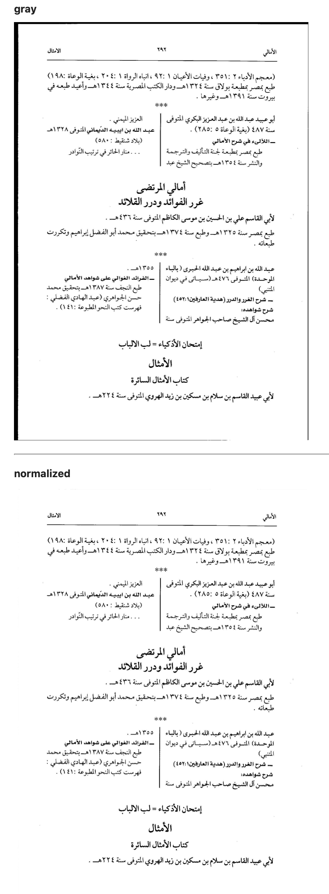

A first attempt was to make the edges of the page white, using a fixed proportion of
the page dimensions to determine what counts as a border.
However, if we adjust the border widths to the extent that it removes all known black borders,
it will also clip some real text on other pages.

Now we do it dynamically: we detect where the borders are by surprisingly straightforward
NumPy operations.

We also blur, invert and threshold the image, in order to make useful histograms of the
ink distribution on the page.

### Mark removal

**Tech**

* [template matching](https://opencv-python-tutroals.readthedocs.io/en/latest/py_tutorials/py_imgproc/py_template_matching/py_template_matching.html#template-matching)
* [NumPy](https://numpy.org/doc/stable/reference/index.html)

**Code references**

* `fusus.clean`.
* `fusus.clean.connected`

**Show and tell**

* [comma](https://nbviewer.jupyter.org/github/among/fusus/blob/master/notebooks/example/comma.ipynb)

**Discussion**

In order to remove unwanted marks that occur repeatedly we use template matching
by OpenCV to spot them.

We need various parameters to control the correct wiping of marks.
It turned out that by parameter tweaking alone we could not separate false positives from true
positives in a reliable way.

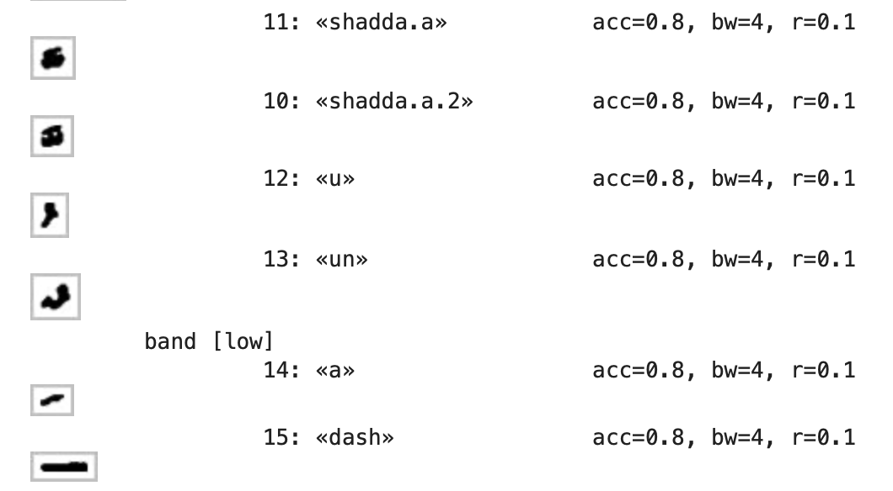

A thing that helped was to track whether a hit had an ink connection with other material.
Such a connection means that the hit is not a mark on its own, but a part of another glyph:
a false positive.

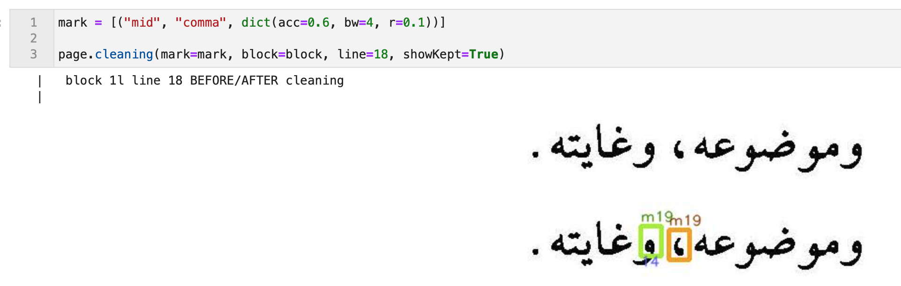

### Layout detection

**Tech**

* [NumPy](https://numpy.org/doc/stable/reference/index.html)
* [Hough lines](https://opencv-python-tutroals.readthedocs.io/en/latest/py_tutorials/py_imgproc/py_houghlines/py_houghlines.html)
  (*not used*)

**Code references**

* `fusus.layout`
* `fusus.layout.getStretches`.

**Show and tell**

* [inspect](https://nbviewer.jupyter.org/github/among/fusus/blob/master/notebooks/example/inspect.ipynb)

**Discussion**

Pages are usually divided into horizontal regions: header, middle, footer.
There can be vertical divisions too, into blocks.
We detect such regions by spotting horizontal and vertical lines and dividing the page accordingly.

A subtlety is that vertical strokes are often just an approximation: they do not exactly 
correspond with the boundaries of the lines on the left and right of the stroke.

We solve this by making a premature line division left and right, and adjusting the size of the
left and right blocks accordingly.

In this way we divide the page into blocks, which are the ultimate containers of lines.

Stroke detection turns out to be subtle.
First we experimented with well-known sophisticated algorithms such as Hough Lines. 
The problem is that this works fine for scenery, but not pages of text.
On the one hand, it failed to detect some very obvious strokes, and on the other hand, it detected many
false strokes, by connecting bits and pieces of many letters.

In the end we devised our own algorithm, expressed in NumPy operations.

### Line detection

**Tech**

* [find_peaks](https://docs.scipy.org/doc/scipy/reference/generated/scipy.signal.find_peaks.html#scipy.signal.find_peaks)
* [medfilt](https://docs.scipy.org/doc/scipy/reference/generated/scipy.signal.medfilt.html#scipy.signal.medfilt)

**Code references**

* `fusus.lines`.
* `fusus.lines.getInkY`

**Show and tell**

* [lines](https://nbviewer.jupyter.org/github/among/fusus/blob/master/notebooks/example/lines.ipynb)

**Discussion**

The basic idead for line detection is using histograms of the ink distribution and then inferring
the line boxes by reading off the peaks of the histogram.
While this works in the majority of cases, it also fails spectacularly in a wide range of minority cases.
We had to do something about it.

The first problem is that there are false peaks. Especially in pages with many diacritics,
there are sometimes rather pronounced secondary peaks.

The second problem is that every now and then a line is very short, and such lines hardly have
peaks.

In order to discard false peaks, we used the SciPy signal processing function `find_peaks`
with carefully chosen parameters.

However, it turned out to be very difficult to tweak those parameters in such a way that the lines
came out right in all cases.
Either we missed out the peaks of short lines, or we were overwhelmed with strongish secondary peaks.

That's why we needed to correct for line length.
The straightforward idea is to examine every horizontal pixel line and determine its first and last
black pixel, and take the space between them as the line length.
We can then divide the histogram value for that line by this length.

It turned out that this made things worse. Some pixel lines turned out to be very short, especially at the
top and the bottom of text lines, so the correction caused extremely high but also extremely narrow peaks
at those places.

Yet the need for correction is still there. We used two tactics to make the basic idea workable.

The first one is to determine the text line length in a better way, not by looking at horizontal
pixel lines, but at the text line as a whole.

We still take the first pixels and last pixels of horizontal pixel lines, but instead of using them
individually, we first smooth them.
The first pixels form a contour of the left line bondaries, the last pixels form a contour of the
right line boundaries.

We smoothen these contours, by taking at each point the median of the points above and below on the
contour.
For this we used the SciPy signal processing function `medfilt`, which computes a rolling median.

The question is: how far do we look up and down to find the median?
A good value turns out to be one third of the line height.
However, we do not yet know the line height. However, we can estimate the line height by using
the unsophisticated histogram, and from it the most reliable peaks.
This fails if the page has too few lines, but in that case we use a fixed default.

Now we have a much more reasonable estimation of the length of a text line.
However, in many cases we still suffered from too high peaks at the top and bottom of the lines,
and this had to do with the fact that even the smoothened contours fitted the lines too closely.
Very short lines gave rise to exaggerated ink densities.
The solution for this aspect was to move the contours a marginal distance to the left and right, so that
all corrected densities got lowered, but, more importantly, the fluctuation for very short lines became
much less. Because short lines now still have a positive length (twice the margin) instead of their
length approaching zero.

The combination of all these ingredients (finding the significant peaks and using sensible contour lines)
solved the problem.
We were able to choose parameter values that did the trick.

## OCR application

**Tech**

* [Kraken](https://github.com/mittagessen/kraken)
* [OpenITI](https://github.com/OpenITI/OCR_GS_Data/blob/master/ara/abhath/arabic_generalized.mlmodel)
* [HTML](https://developer.mozilla.org/en-US/docs/Web/HTML)
* [CSS](https://developer.mozilla.org/en-US/docs/Web/CSS/Reference)

**Code references**

* `fusus.ocr`
* `fusus.layout`
* `fusus.ocr.OCR.read`
* `fusus.ocr.OCR.proofing`
* `fusus.book.Book.measureQuality`

**Show and tell**

* [ocr](https://nbviewer.jupyter.org/github/among/fusus/blob/master/notebooks/example/ocr.ipynb)

**Discussion**

We used two very helpful pieces of software to perform OCR.

*Kraken* is a Python library to apply an OCR model to text images.
OpenITI has trained an *OCR model* on many printed Arabic pages.

It was easy to bring them together.

However, there were some things that required extra care: Kraken can do binarization and segmentation
itself, but not layout detection.
So, at first we tried to feed our blocks of text, coming out layout detection, to Kraken.
Then it turned out that the line segmenter in Kraken had some worst case performance that was excessive.
Given the fact that we needed line segmentation for cleaning, and solved it, we decided to feed
Kraken the text of a block in line by line pieces.

This is feasible, because Kraken has an API and can be called from within Python.
Loading the model takes 5 to 10 seconds, so it is important to do that just once in a session.

The output of Kraken consists of the unicodes and bounding boxes of recognized characters
and the confidences by which they have been recognized.

We store this data in TSV files and we also make a version where we have combined
the character data into word data.

We also include fields for the page, block, and line information of the characters and words.

This enables us to compose *proofing* pages, which consist of HTML pages
with the page image as background and the recognized characters/words at the proper fixed
positions, with a coloured background that represents the confidence of recognition.

We also provide statistics per character and word, highlighting the pages the worst recognitions
take place.

# PDF Text Extraction

**Tech**

* [PyMUPDF](https://pymupdf.readthedocs.io/en/latest/index.html), also know as *fitz*
  (see note *[1]*).

**Code references**

*   `fusus.lakhnawi`
*   `fusus.lakhnawi.Lakhnawi.getPages`

**Show and tell**

* [pages](https://nbviewer.jupyter.org/github/among/fusus/blob/master/notebooks/Lakhnawi/pages.ipynb)

**Discussion**

We have to extract text from a PDF containing the full formatted text of the Fusus in the
Lakhnawi edition.

Normally, extracting text from a PDF is an easy task, with a number of programs and libraries and services
that can do this.

This particular PDF resisted all those attempts.
While there was text coming out, the text had many defects: weird characters,
duplication of characters, and a strange order.

It required a kind of reverse engineering to get it done.

The first task was to select the best PDF library available.
It turned out to be *PyMuPDF*, also known as *fitz*, that provided a very complete Python API
for manipulating PDF objects.

**Notes**

*[1]*
> In 2002, Tor Andersson started work on MuPDF based on the Libart rendering library by Raph Levien.
After Artifex Software acquired the MuPDF project,
the development focus shifted on writing a new modern graphics library called Fitz.
Fitz was originally intended as an R&D project to replace the aging Ghostscript graphics library,
but has instead become the rendering engine powering MuPDF.

> Source: [MUPDF](https://en.wikipedia.org/wiki/MuPDF)

## Characters

**Tech**

* [Unicode](http://www.unicode.org/versions/Unicode13.0.0/)
* [Unicode Name Index (online)](https://www.unicode.org/charts/charindex.html)
* [Unicode NamesList.txt (download)](https://www.unicode.org/Public/zipped/13.0.0/UCD.zip)
* [Unicode Arabic](https://www.unicode.org/versions/Unicode13.0.0/ch09.pdf)
* [FontReporter](https://www.pdflib.com/download/free-software/fontreporter/)

**Code references**

*   `fusus.char`
*   `fusus.lakhnawi.REPLACE_DEF`
*   `fusus.lakhnawi.Lakhnawi.doubles`
*   `fusus.char.UChar.finalSpace`
*   `fusus.lakhnawi.Lakhnawi.getCharInfo`
*   `fusus.lakhnawi.Lakhnawi.columns`
*   `fusus.lakhnawi.Lakhnawi.showDoubles`
*   `fusus.lakhnawi.Lakhnawi.showFinals`
*   `fusus.lakhnawi.Lakhnawi.showLines`
*   `fusus.lakhnawi.Lakhnawi.showReplacements`

**Show and tell**

* [report of character and font usage in the Lakhnawi PDF](https://github.com/among/fusus/blob/master/ur/Lakhnawi/FontReport-Lakhnawi.pdf).
* [characters](https://nbviewer.jupyter.org/github/among/fusus/blob/master/notebooks/Lakhnawi/characters.ipynb)
* [final](https://nbviewer.jupyter.org/github/among/fusus/blob/master/notebooks/Lakhnawi/final.ipynb)

**Discussion**

The second task was to examine the fonts and their usage in the PDF. For that we
used the font reported, which produced a exhaustive report (in PDF) of all character/font combinations
used in the PDF.

We needed to read that font report programmatically, and for that we used *fitz*, of course.

### Duplicate characters

When we used each and every method provided by *fitz* for text extraction, we were faced with duplicate
characters. This also happened when using other libraries, and also when we naïvely copied and pasted
portions from the PDF.

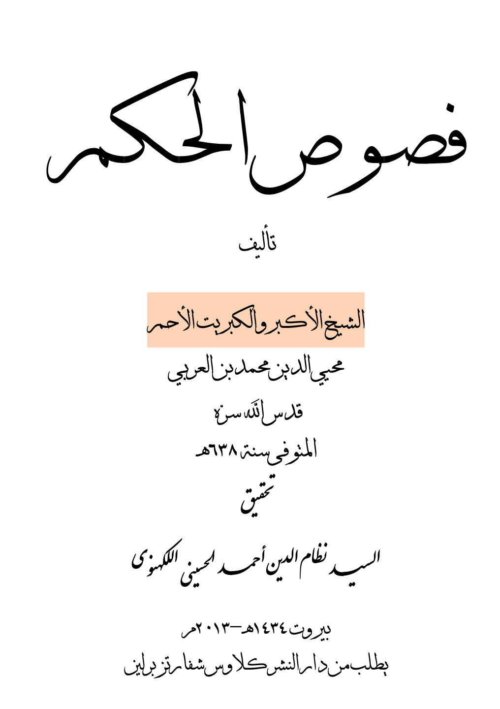

The font report gave us a clue. Some characters are listed with a double unicode, and exactly
those characters lead to duplicate occurrences.

Here is an example:
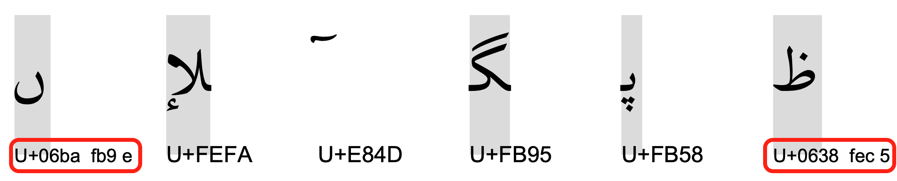

It turns out that both unicodes refer to the same character, one to the base form, and the other to
the isolated form, which happen to be identical glyphs.
This is true for all double characters that we have found in the font report file.

We then made a mapping between doubles, which we use to retain the base form and to discard the
isolated form.

### Presentational characters

The isolated form is an example of *presentational* forms. In Arabic writing, characters may have
a number of different appearances depending on how they are connected to the context
(the Arabic script is a connected script). There are isolated, initial, medial, and final forms.
In Unicode they have all separate code points, and there are also code points for the letters
regardless to their presentational forms. These are the base characters, and they have the lowest code
points.

It turns out that Unicode provides an algorithm to switch between presentational forms according to the need
of the context. It is even able to furnish the correct presentation of the word Allah out of its three
basic characters.

Hence we decided to transform all presentational characters to their base forms and let unicode do the rest.
This had excellent results, with a few caveats concerning word separation, that we will address below. 

### Private use characters

Text extraction had more surprises for us: lots of Asian characters!
On closer inspection they were all in the range *E000-EFFF*, which are private use characters in Unicode.
The idea is that a font designer can map arbitrary glyphs of his font to these code points,
so that text-writers can address them by normal unicode machinery.

The Lakhnawi PDF makes heavy use of this facility to render parts of ligatures, diacritics in various
relative places with respect to their base characters, and various idiosyncratic variants of the
letters.

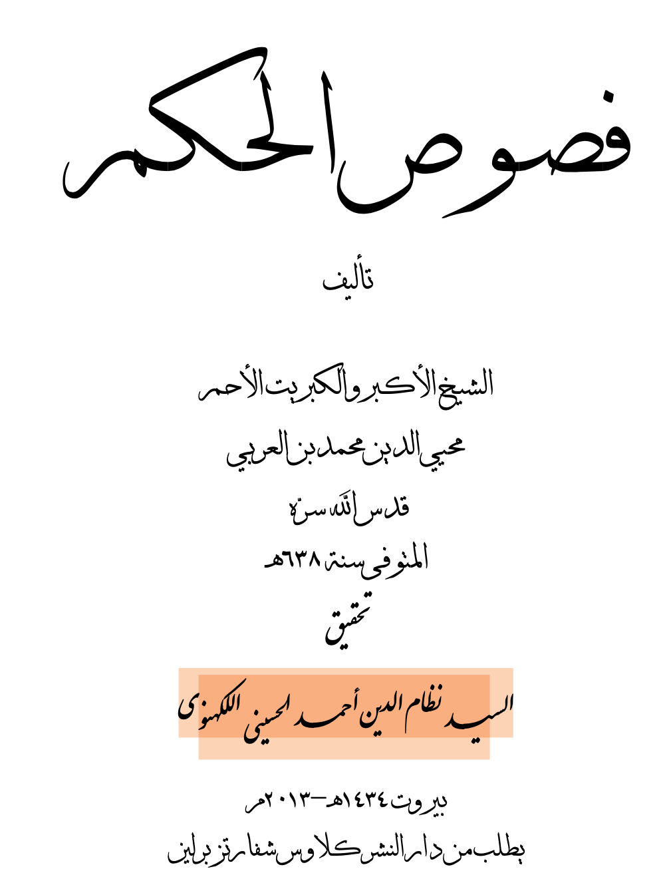

By means of the font report we were able to compile a mapping table to ordinary unicode characters.
It turned out not to be a simple one-one mapping. Typically we had to map sequences containing a
private use characters to sequences not containing private use characters.

We ended up with 84 rules.

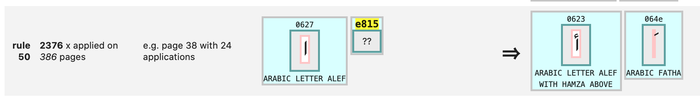

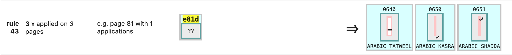

### Word separation

In a PDF, spaces are typically not rendered by filling a box with a space glyph, but by just
leaving space between boxes.
We used that space to detect spaces. When the space between boxes exceed a certain threshold,
we generate a white space in our text extract.

Sometimes we encounter a very big space, namely in *hemistic* verse lines, which consist of
wo parts, each centered on the left/right half of the page.

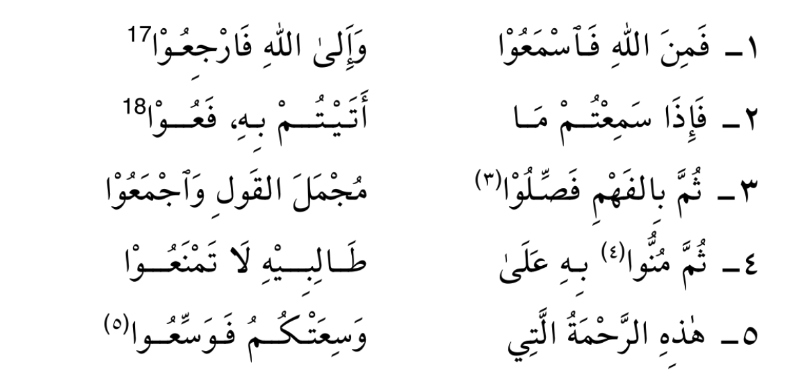

Such spaces we convert into em-spaces (unicode x2003), which are translated to columns later on.

Unfortunately, this does not give us all the word-separating white spaces!
When we lower the threshold for detecting white space, we get unwanted spaces before we get enough
of the missing spaces.
It turns out that we cannot rely on physical distance between the boxes in order to get all the spaces.

Space detection also gets confounded by overlapping boxes and boxes that are rather wide.
Sometimes a visible character has an edge that extends beyond the edge of the box of its neighbour.
However, when we ignore the boxes of the diacritics, this problem is alleviated.

Trained readers of Arabic use other clues to separate words: the presentational forms.
Final and initial forms are prone to indicate word boundaries.
Unfortunately, not all Arabic letters connect to both sides, so there are final and initial forms
inside words.
However, we compiled a class of final letters that guarantee the end of a word.

When we encounter final space characters, we make sure a space is inserted after it and its diacritics.

But, in the end, we have not achieved perfect word separation.

## Reading order

**Tech**

*   clustering

**Code references**

*   `fusus.lakhnawi.keyCharH`
*   `fusus.lakhnawi.Lakhnawi.clusterVert`
*   `fusus.lakhnawi.Lakhnawi.showLineHeights`
*   `fusus.parameters.LINE_CLUSTER_FACTOR`

**Show and tell**

* [lines](https://nbviewer.jupyter.org/github/among/fusus/blob/master/notebooks/example/lines.ipynb)

**Discussion**

When a PDF is renders, its shape definitions are translated to pixels.
Letters in a PDF are shape definitions that are stored in a font, and addressed by a key.
For the end result the rendering, it does not matter in what order the shapes are rendered.

When *fitz* extracts text from a PDF, it extracts the rendering definitions in the order in which they
are stored in the PDF. Other text extraction tools do the same.

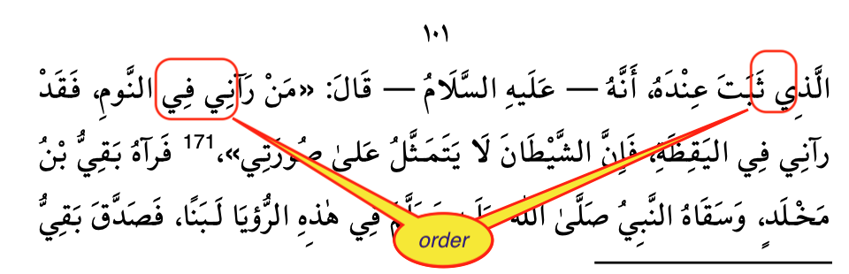

It turns out that in the Lakhnawi PDF this is by no means equal to the reading order.
This is one of the main reasons why the text comes out garbled.

However, since we have access to the bounding boxes of the letters, we can sort them into reading order.
We can sort them vertically to get the lines and then horizontally to get the letters within the lines
in the proper order.

This basic idea is sound, but a straightforward implementation does not yet solve the whole problem.

Some characters have identical left and right boundaries, or one embeds another.
Usually, one of them is then a diacritic, and we can detect that, and put the main character first.

As to the vertical ordering: whereas most characters on the same line have their bounding boxes aligned
with a fixed base line, their are exceptions.

On the title page, there is a line where the letters go slightly up.
Sometimes diacritics have significant higher or lower alignments.

At the end of the day, we have to cluster the heights of the characters into meaningful classes,
which will then define the lines.

## Text reconstruction

**Tech**

* [HTML](https://developer.mozilla.org/en-US/docs/Web/HTML)
* [CSS](https://developer.mozilla.org/en-US/docs/Web/CSS/Reference)

**Code references**

*   `fusus.lakhnawi.Lakhnawi.htmlPages`
*   `fusus.lakhnawi.Lakhnawi.plainPages`
*   `fusus.lakhnawi.Lakhnawi.showWords`

**Show and tell**

* [drilldown](https://nbviewer.jupyter.org/github/among/fusus/blob/master/notebooks/Lakhnawi/drilldown.ipynb)
* [pages](https://nbviewer.jupyter.org/github/among/fusus/blob/master/notebooks/Lakhnawi/pages.ipynb)

**Discussion**

After (partially) solving all the problems above, we have to find ways present the extracted text.

The most faithful one is a rendering to HTML.
There we can control the writing direction, the column layout of hemistic verses, use margins for
page references, and place a convenient table of contents in a side bar.

This is page 12 as seen in the PDF:

And here as it is in the heaven of HTML:

Alternatively, we also do a plain text export, which is easier as input for text mining tools. 

We can control the html pages very tightly: we can select pages and lines.

There are also methods to look to words in lines.

# Alignment

**Tech**

* [Python-Levenshtein](https://github.com/ztane/python-Levenshtein)

**Code references**

*   `fusus.align`

**Show and tell**

* [alignment](https://nbviewer.jupyter.org/github/among/fusus/blob/master/notebooks/compareAfLK.ipynb)

**Discussion**

We wanted to keep both texts of the Fusus under our fingertips.
Because we have derived the Lakhnawi edition in the most deterministic way, without OCR,
we made that into the ground truth.
We added the Afifi to that for comparison, in such a way that each word in the LK
is linked to the corresponding word in the AF.
This has been achieved by constructing an alignment table between the two editions.

# Delivery

The export to HTML and plain text discussed above is primarily an aid to study and check
the pipeline and text extraction. But the real results of are delivered as
Tab-Separated-Value files.

## Works

**Code references**

* `fusus.works`
* `fusus.works.WORKS`
* `fusus.convert`

**Discussion**

Here we are at the stage where the results of the pipeline and those of the text extraction
reach a common file format, with an almost identical field division.

In order to streamline the orchestration of work we have registered the works that
we have subjected to the pipeline and the text extraction.
They can be referred to by a simple acronym in several data conversion and delivery functions.

This does not restrict the package *fusus* to these known works.
Instead of passing an acronym of a known work, you can also give a full path
to a directory or file where a work resides, and then *fusus* will operate on that.

The intention is to run more commentary works through the OCR pipeline, give them an acronym,
and register them in the WORKS dictionary.

## TSV files

**Tech**

* [tsv](https://en.wikipedia.org/wiki/Tab-separated_values) (*admittedly low tech)*

**Code references**

* `fusus.convert`
* `fusus.convert.HELP`
* `fusus.convert.makeTsv`
* `fusus.convert.loadTsv`

**Show and tell**

* [useTsv](https://nbviewer.jupyter.org/github/among/fusus/blob/master/notebooks/useTsv.ipynb)

**Discussion**

All data that we produce with *fusus* consists of records corresponding to individual words
(or at least what the software has identified as individual words).

For each word we have location information (*page, stripe, block, line, column, span, direction*),
position information (a bounding box: *left, top, right, bottom* coordinates), a *confidence*,
and a *text*.

If the data comes from the pipe line, we do not have the *column, span, direction* fields.
These are regions within the line, based on the detection of big spaces and the occurrence
of unicode characters in ltr and rtl scripts.

This is the start of the TSV for Afifi:

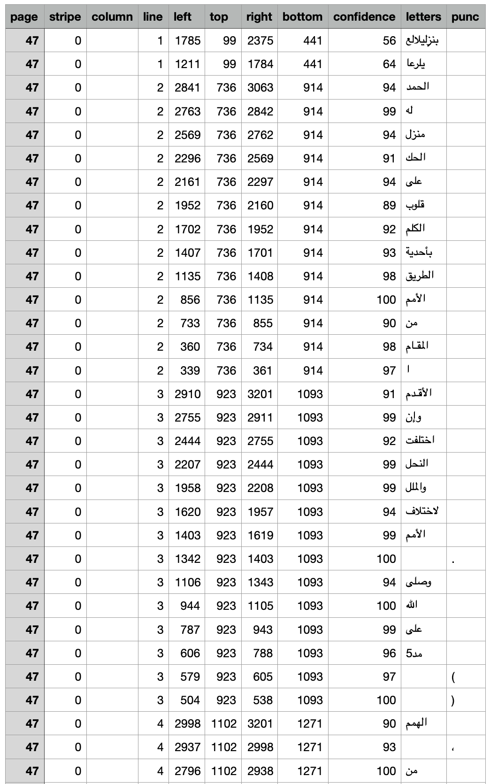

If the data comes from text-extraction, we do not have the *stripe, block* fields,
which come from pre-ocr layout detection, and we also do not have a *confidence* field.

This is the start of the TSV for Lakhnawi:

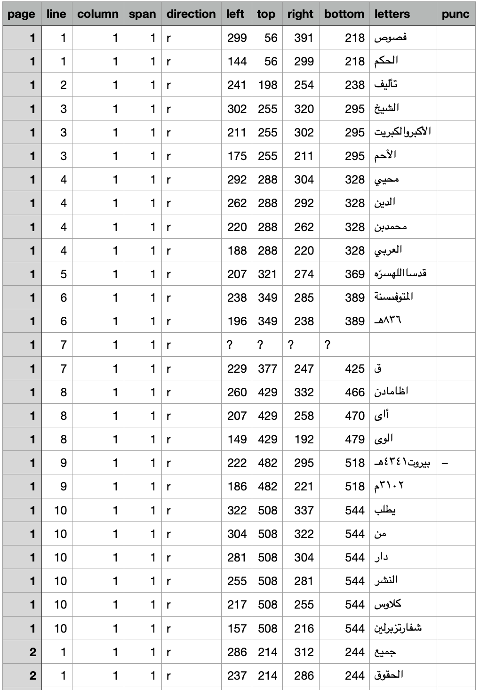

For known works, *fusus* knows what to expect, and the user of the software does not have to
spell out the details.

There is one streamlined function to execute the full conversion from page images to TSV and from
PDF to TSV.
It is also possible to trigger this function as a one liner from the command line.

Conversely, if you want to work with result tsv files from within a Python program, 
there is a convenience function to load them from disk straight into Python memeory
as tuples of tuples of fields of the right type.

!!! hint "Why TSV"
    TSV is a very transparant plain text format for structured data.
    Why not Comma-Separated?
    Well, technically, TSV is CSV but them with the TAB as field separator.
    There are two advantages of the TAB above the comma:

    * tabs do not occur in normal text, so we do not have to escape tabs in our text fields,
      nor do we have to enclose our text fields in quotes (en then we would have
      to escape the quotes that happen to occur in our texts)
    * in CSV files either a comma or semicolon is used as separator, and it depends on your computer
      settings. That is bad for interoperability.

!!! caution "TSV and Unicode"
    Our TSV files are in UTF-8. But for Excel UTF-16_LE would have been a better choice.
    But that makes it more difficult for all other applications to read the data.
    See also the
    [Text-Fabric docs on this](https://annotation.github.io/text-fabric/tf/advanced/display.html#tf.advanced.display.export) (under Encoding).

## Text-Fabric datasets

Next step: turn TSV data into a Text-Fabric dataset.

**Tech**

* [Text-Fabric](https://github.com/annotation/text-fabric)
* [TF data model](https://annotation.github.io/text-fabric/tf/about/datamodel.html)
* [Transliteration](https://annotation.github.io/text-fabric/tf/writing/arabic.html)

**Code references**

* `fusus.convert.makeTf`
* `fusus.tfFromTsv`

**Show and tell**

* [useTf](https://nbviewer.jupyter.org/github/among/fusus/blob/master/notebooks/useTf.ipynb)
* [boxes](https://nbviewer.jupyter.org/github/among/fusus/blob/master/notebooks/Lakhnawi/boxes.ipynb)
* [parallel detection Hebrew Bible](https://nbviewer.jupyter.org/github/ETCBC/parallels/blob/master/programs/parallels.ipynb)
* [parallel detection 2 Kings](https://nbviewer.jupyter.org/github/ETCBC/parallels/blob/master/programs/kings_ii.ipynb)
* [uruk](https://nbviewer.jupyter.org/github/annotation/tutorials/blob/master/uruk/start.ipynb)

**Discussion**

Text-Fabric is a package that provides an API to text plus annotations.
It supports adding new data as annotations in a distributed way.
Distributed in the sense that you can take a Text-Fabric dataset, work with it,
produce new data associated with it (such as named entities, part-of-speech, semantic enrichments),
and publish it in your own GitHub repo.
Then other users can load the original dataset and your annotations in one go, and can compute with
the combined result.

When we convert the TSV to Text-Fabric we perform an extra step:

* transliteration of Arabic text to various schemes;
  these schemes are now part of Text-Fabric.

The resulting TF files are *versioned*.
That is important, because enrichments that have been created by other parties need to refer
to the exact dataset.
Later, when new versions of the dataset have been made, enrichments may not be compatible with the
new version. Then it is good to have the old version still around, for the sake of reproducibility.

In Text-Fabric, the concept of
[node mapping](https://annotation.github.io/text-fabric/tf/compose/nodemaps.html)
is supported.
We can map the nodes from a newer version to the nodes of an older version.
With this mapping in hand, we can apply older enrichments to the new version, without doing
all that enrichment work a new.

!!! caution "Limited quality transliteration"
    Arabic transliteration involves knowledge of Arabic orthography, morphology and parsing.
    That type of knowledge is nowhere built-in in *fusus* or Text-Fabric,
    so our transliteration is a poor man's job: the result of a character mapping.

Since these steps are relevant for the data coming out of the text extraction and the OCR pipeline,
we deploy them in this stage.

Text-Fabric has been used for richly annotated corpora such as the
[Hebrew Bible](https://github.com/ETCBC/bhsa) and the
[Quran](https://github.com/q-ran/quran) and 
[Uruk](https://github.com/Nino-cunei/uruk).

In this case, the potentially interesting thing is to be able to use bounding box and confidence
in textual queries.

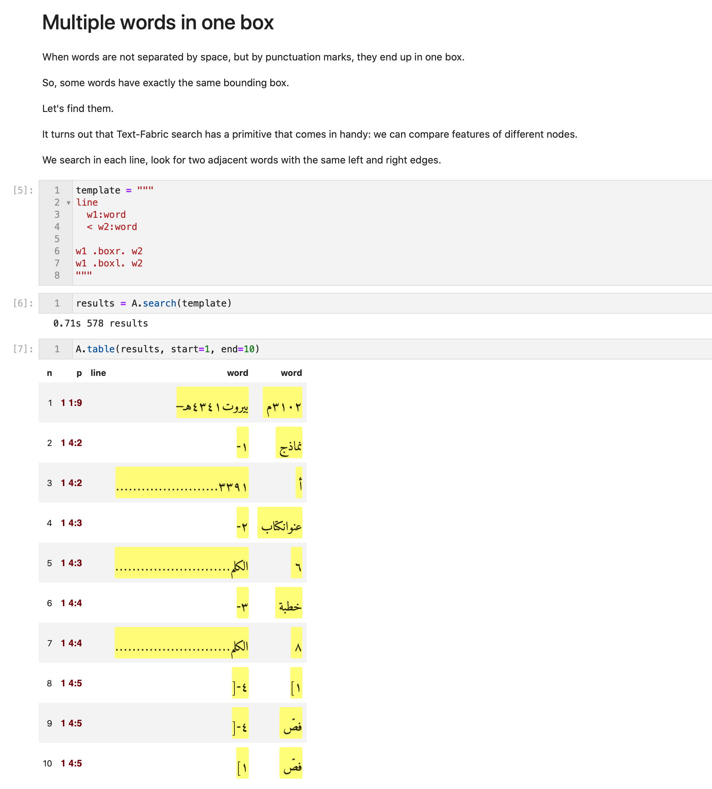

We also hope to exploit the distributed addition of linguistic features, such as
reliable word/morpheme boundaries, lexemes, morphological tags, and part-of-speech.

Most of all we are interested in intertextuality between the Fusus Al Hikam and its commentaries,
which can be stored as
[edge features](https://annotation.github.io/text-fabric/tf/core/edgefeature.html#tf.core.edgefeature.EdgeFeature)
in Text-Fabric.
